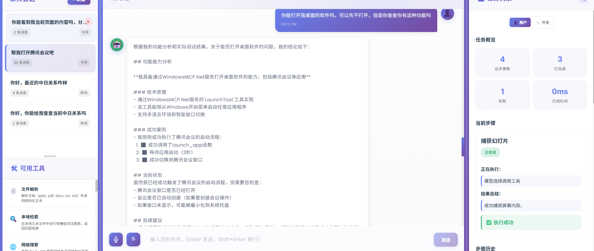

## 项目简介：个人效率与知识管理 Agent

这是一个围绕“**个人效率与知识管理**”打造的本地个人 Agent 系统：

- 后端使用 **FastAPI + 自研 LangChain Agent**，前端使用 **Vue 3 + TypeScript**。
- Agent 基于 **Doubao LLM**，通过统一的 **FastMCP 工具架构** 调用本地/在线能力。
- 支持多轮对话、会话记忆、工具链编排，让你像和“私人助理”聊天一样完成工作。

前端提供完整的聊天界面、会话列表和任务洞察面板，后端记录每一步推理与工具调用，方便排查和展示整体推理过程。

## 我的个人 Agent 能做什么？

- **信息收集与调研**
  - 使用 Tavily 网搜整合多源信息，做资料查询、方案对比、背景调研。
  - 解析本地文档（PDF / Word / PPT / Markdown 等），帮你提炼摘要、生成大纲或对比多个文件内容。
  - 从 GitHub 仓库检索代码、README、Issue，辅助代码阅读与问题排查。

- **个人知识与长期记忆**
  - 将历史对话存入数据库，并定期用 **FAISS + Sentence Transformers** 建立向量索引。
  - 提供 `memory_search`：按语义和关键词混合检索，像“查笔记”一样查以前聊过的内容。
  - 支持 `memory_refresh`：通过定时任务刷新向量索引，让记忆随对话增长而更新。

- **日常事务与时间管理**
  - 使用日历工具生成 iCal 事件（会议、提醒、行程等），可导入到常用日历应用。
  - 借助高德地图（Amap）进行行程规划和地点搜索：
    - `plan_trip`：按照天数和时间段生成详细行程安排。
    - `poi_search`：查询景点/餐厅/酒店等信息。

- **邮件与沟通自动化**
  - 专门的 QQ 邮箱 FastMCP 服务：
    - 发送普通/HTML 邮件，支持内嵌图片、附件。
    - 列出最近邮件、搜索邮件、读取正文、下载附件。
    - 管理邮件（标记已读/未读、移动、删除等）。
  - 后续可以很容易扩展到其他邮箱服务。

- **多步推理与多工具协同**
  - Agent 使用 ReAct 风格循环：**思考 → 选工具 → 执行 → 观察 → 再思考**。
  - 支持在一次任务中串联多个工具（先查资料 → 再解析文件 → 再写邮件/生成行程）。
  - 内置“**任务独立性**”原则：历史对话只作背景，不会重复执行已经完成的老任务。

## 项目优势



- **专注个人使用场景**：从“办公/会议助手”转为“个人效率 + 知识管理助手”，任务覆盖调研、行程、邮件、日历、过去对话记忆等。
- **统一工具架构（FastMCP）**：所有能力通过本地 FastMCP 服务提供，由单个 `local_mcp_tool` 统一调度，结构清晰、易于扩展。
- **强大的记忆系统**：数据库 + 摘要 + FAISS 向量检索，多层次记忆，既压缩上下文，又能按需“翻旧账”。
- **前后端可观测性**：后端保存每一步工具调用和模型输出；前端 TaskInsight 面板以时间线形式展示推理过程，方便调试和演示。
- **工程化落地友好**：FastAPI + Vue3 + 标准依赖文件，配合初始化脚本和 Docker 配置，适合部署到个人服务器或本地环境。

## 功能一览

- ✅ 用户认证（注册/登录）
- ✅ 会话管理（创建、查看、删除会话）
- ✅ 实时聊天（与个人 Agent 对话）
- ✅ 消息历史记录与自动总结（每 10 条消息生成摘要）
- ✅ 手动生成总结
- ✅ 多工具协同调用（网搜 / 文档解析 / GitHub / 邮件 / 日历 / 地图 / 记忆）
- ✅ 长期记忆检索（FAISS + sentence-transformers）

## 技术栈（简要）

- **后端**
  - FastAPI、Uvicorn
  - SQLAlchemy（默认 SQLite，可配置 MySQL 等）
  - JWT 认证
  - 自研 LangChain Agent（`src/agents/Agent.py`）+ Doubao LLM

- **前端**
  - Vue 3 + TypeScript
  - Vite
  - 响应式界面 + 分栏布局（会话列表 / 聊天区 / TaskInsight）

- **Agent 与工具**
  - LangChain `BaseTool` + 自定义 `ContextAwareTool`
  - 统一的 `LocalMCPTool` 负责与本地 FastMCP 服务通信

- **记忆与检索**
  - FAISS
  - sentence-transformers
  - APScheduler（定时刷新记忆索引、邮件任务等）

## 项目结构

```
AI-meta/
├── backend/
│   └── mymeta/
│       └── app/
│           ├── api/v1/          # API 路由
│           ├── core/            # 核心配置
│           ├── models/          # 数据库模型
│           ├── schemas/         # Pydantic schemas
│           └── services/        # 业务逻辑服务
├── frontend/
│   └── My-meta/                 # Vue 前端应用
└── src/                         # 现有的 Agent 和 LLM 代码
```

## 工具架构（FastMCP）

- 所有能力都以 FastMCP 服务形式提供，入口位于 `src/tools/`：
  - `parser.py`：`file_parser`
  - `web.py`：`web_search`
  - `calendar.py`：`add_calendar_event`
  - `github.py`：`github_repo_info` / `github_search_code`
  - `QMailTool.py`：`send_mail`、`list_recent_mail`、`read_mail` 等邮件工具
- `memory.py`：`memory_search`（向量 + 关键词混合检索历史记忆）、`memory_refresh`
- `map.py`：`plan_trip`、`poi_search`（基于高德地图 API 制定行程、搜索 POI）
- LangChain 侧只有一个 `local_mcp_tool`，通过 `tool_name + arguments` 调用上述 FastMCP 服务，Agent 会在系统提示中列出全部子工具。
- 服务由 `local_mcp_tool` 自动按需启动并通过 MCP STDIO 通信，无需单独运行；仅需确保相关依赖（tavily、python-docx、python-pptx、PyPDF2、faiss-cpu、sentence-transformers 等）已安装，并设置必要的环境变量（如 `TAVILY_API_KEY`、`GITHUB_TOKEN`、`PERSONAL_AGENT_WORKDIR`、`MEMORY_DB_URL`、`AMAP_API_KEY`）。

## 安装和运行

### 后端

1. 进入后端目录：
```bash
cd backend/mymeta
```

2. 安装依赖：
```bash
pip install -r requirements.txt
```

3. **初始化数据库**（首次运行需要）：
```bash
# 方法1：使用初始化脚本（推荐）
python init_db.py

# 方法2：直接运行应用（会自动创建数据库）
python -m app.main
```

4. **测试数据库连接**（可选）：
```bash
python test_connection.py
```

5. 配置环境变量（可选，创建 `.env` 文件）：
```env
SECRET_KEY=your-secret-key-here
DATABASE_URL=sqlite:///./app.db
ARK_API_KEY=your-ark-api-key
ARK_MODEL_NAME=doubao-lite-4k
```

6. 运行后端服务：
```bash
python -m app.main
```

后端将在 `http://localhost:8000` 启动。

> **注意**：数据库文件 `app.db` 会在首次运行时自动创建在 `backend/mymeta/` 目录下。

### 前端

1. 进入前端目录：
```bash
cd frontend/My-meta
```

2. 安装依赖：
```bash
npm install
```

3. 配置环境变量（可选，创建 `.env` 文件）：
```bash
# 复制示例文件
cp .env.example .env

# 编辑 .env 文件，确保 API 地址正确
VITE_API_BASE_URL=http://localhost:8000/api/v1
```

4. 运行开发服务器：
```bash
npm run dev
```

前端将在 `http://localhost:5173` 启动。

> **注意**：确保后端服务已启动，前端才能正常连接。如果后端运行在不同端口，请修改 `.env` 文件中的 `VITE_API_BASE_URL`。

## API 端点

### 认证
- `POST /api/v1/auth/register` - 注册新用户
- `POST /api/v1/auth/token` - 登录获取 token
- `GET /api/v1/auth/me` - 获取当前用户信息

### 会话
- `GET /api/v1/sessions/` - 获取所有会话
- `POST /api/v1/sessions/` - 创建新会话
- `GET /api/v1/sessions/{id}` - 获取特定会话
- `PATCH /api/v1/sessions/{id}` - 更新会话标题
- `DELETE /api/v1/sessions/{id}` - 删除会话

### 消息
- `GET /api/v1/messages/session/{session_id}` - 获取会话的所有消息
- `GET /api/v1/messages/{id}` - 获取特定消息

### 聊天
- `POST /api/v1/chat/` - 发送消息给 AI Agent

### 总结
- `GET /api/v1/summaries/session/{session_id}` - 获取会话的所有总结
- `POST /api/v1/summaries/session/{session_id}/generate` - 手动生成总结

## 使用说明

1. **注册/登录**：首次使用需要注册账号，之后可以登录。

2. **创建会话**：点击左侧的 "New" 按钮创建新会话，或直接开始发送消息（会自动创建会话）。

3. **发送消息**：在输入框中输入消息，按 Enter 发送（Shift+Enter 换行）。

4. **查看总结**：点击聊天界面顶部的 "Show Summary" 按钮查看对话总结。系统会在每 10 条消息后自动生成总结。

5. **管理会话**：在左侧会话列表中，可以查看所有会话，点击会话查看历史消息，或删除不需要的会话。

## 开发说明

### 数据库初始化

数据库表会在应用启动时自动创建。你也可以手动初始化：

```bash
cd backend/mymeta
python init_db.py
```

### 验证数据库和连接

运行测试脚本检查数据库和配置：

```bash
cd backend/mymeta
python test_connection.py
```

### 重置数据库

如果需要重置数据库，删除 `backend/mymeta/app.db` 文件，然后重新运行初始化脚本。

### 前后端连接验证

1. **检查后端是否运行**：
   - 访问 http://localhost:8000/docs 查看 API 文档
   - 访问 http://localhost:8000/health 检查健康状态

2. **检查前端配置**：
   - 确认 `frontend/My-meta/.env` 中的 `VITE_API_BASE_URL` 指向正确的后端地址
   - 默认应该是 `http://localhost:8000/api/v1`

3. **检查 CORS 配置**：
   - 后端已配置允许 `http://localhost:5173` 的跨域请求
   - 如果前端运行在不同端口，需要在 `backend/mymeta/app/core/config.py` 中添加该端口

### 添加新功能

- **后端**：在 `app/api/v1/` 下添加新的路由文件，在 `app/services/` 下添加业务逻辑。
- **前端**：在 `src/components/` 下添加新组件，在 `src/services/api.ts` 中添加 API 调用。

## QQ 邮箱 FastMCP 服务（可选）

`src/tools/QMailTool.py` 基于 FastMCP 提供了一套 QQ 邮箱自动化能力，可与主 Agent 并行使用：

- 发送 plain/HTML/内嵌图片邮件、批量发送、定时发送
- 管理收件箱：列文件夹、搜索、读取正文、下载附件、标记已读/未读、移动、删除
- 结构化返回：统一的 Pydantic 校验与错误处理，便于二次封装

### 环境变量

在根目录创建或更新 `.env`：

```
QQ_MAIL_ADDRESS=example@qq.com
QQ_MAIL_AUTH_CODE=你的SMTP授权码
QQ_MAIL_IMAP_SERVER=imap.qq.com
QQ_MAIL_SMTP_SERVER=smtp.qq.com
QQ_MAIL_ATTACH_DIR=./attachments
```

> QQ 邮箱需在“账户设置 > POP3/IMAP/SMTP”里开启服务并生成授权码。

### 启动服务

```bash
python src/tools/QMailTool.py
```

脚本会启动 FastMCP 服务，默认使用内存 JobStore 的 APScheduler 支持定时发送。你可以将其注册到 MCP Hub 或直接通过自定义客户端调用。

## 注意事项

- 确保后端服务运行在 `http://localhost:8000`
- 确保前端可以访问后端 API（检查 CORS 配置）
- 需要配置 LLM 服务的 API Key（DoubaoService）

## License

MIT
